# RIR API
**Julio 2026**

---

## Abstract

 

## Introducción

En acústica de salas es imprescindible contar con equipamiento para llevar adelante las mediciones de parámetros acústicos. Estas mediciones permiten caracterizar a cada recinto e implementar soluciones acústicas de ser necesario. Para ello se desarrolló este software, que propone una API REST abierta que automatiza todo el proceso: desde señales de excitación (sine sweep y ruido rosa), a grabación de audio, procesamiento de respuesta al impulso y devolución de parámetros acústicos. 

La API REST fue desarrollada en FastAPI con una arquitectura dividida en tres módulos (generación de señales de excitación, procesamiento de RI y cálculo de parámetros) y en lenguaje Python. Los parámetros que devuelve son EDT, T20, T30, T60, D50 y C80 según norma ISO 3382. El presente informe detalla la arquitectura del software junto a los fundamentos matemáticos detras de la lógica de los algoritmos y comparaciones con softwares comerciales. 

 

## Metodología

El software se subdivide en tres capas operacionales: routers (punto de entrada del protocolo http, documentan endpoints y delegan), schemas (se definen los esquemas de peticiones y respuestas con Pydantic) y services (concentran la lógica de negocio y DSP). La arquitectura se divide también en tres módulos, correspondientes a cada etapa: generation (generación de ruido rosa, sine sweep logarítmico y flujo de reproducción/grabación), processing (carga de audio, obtención de RI, filtrado por octava, escala logarítmica y síntesis de la RI) y acoustics (integral de Schroeder, regresión lineal y cálculo de parámetros acústicos). La figura 1 indica el diagrama de arquitectura y sus endpoints. 

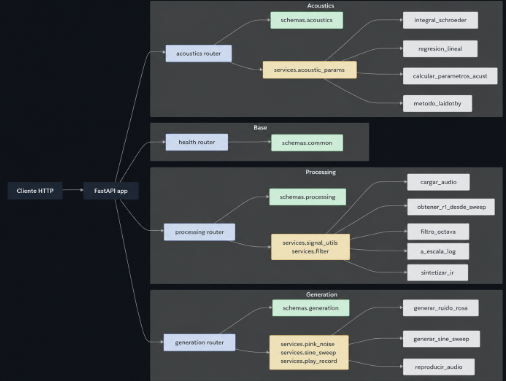
 
**Figura 1:** Diagrama de arquitectura de RIR API
 

### Endpoints clave

**Base:** `GET /health` (estado de salud de la API)

 

**Generation:**  
* `POST /api/v1/generation/pink-noise`. Genera ruido rosa y devuelve un archivo WAV. Se usa un filtrado espectral $$\frac{1}{\sqrt{f}}$$ sobre ruido blanco en dominio frecuencial (FFT): $$S_{rosa}(f)=\frac{S_{blanco}(f)}{\sqrt{f}}$$. Densidad espectral de potencia resultante: $$P(f) \propto \frac{1}{f(-3dB/oct)}$$
* `POST /api/v1/generation/sine-sweep`. Genera sine sweep y devuelve un archivo WAV. Barrido sinusoidal logarítmico (Farina, 2000): $$x(t)=sin(\frac{\omega_1T}{ln(\omega_2/\omega_1)}(e^{\frac{t}{T}ln\frac{\omega_2}{\omega_1}}-1))$$, donde $$T$$ es la duración, $$\omega_1=2\pi f_{inicial}$$ y $$\omega_2=2\pi f_{final}$$. 
* `POST /api/v1/generation/sine-sweep/inverse-filter`. Genera el filtro inverso del sweep, que es el sweep invertido temporalmente con envolvente de corrección de amplitud: $$x_{inv}(t)=x(T-t)\cdot e^{\frac{t}{T}ln\frac{\omega_2}{\omega_1}}$$. 
* `POST /api/v1/generation/upload-recording`. Recibe una grabación del navegador y la devuelve. 

 

**Processing:**
* `POST /api/v1/processing/impulse-response`. Realiza la deconvolución: $$h(t)\approx y(t)*x_{inv}(t)$$, donde $$y(t)$$ es la grabación y $$x_{inv}(t)$$ es el filtro inverso del sweep. Devuelve la respuesta al impulso (RI).
* `POST /api/v1/processing/octave-filter`. Filtra la RI por banda de octava.
* `POST /api/v1/processing/log-scale`. Convierte la RI a escala logarítmica (dB): $$L(t)=20log_{10}(\frac{|h(t)|}{max|h(t)|})$$. Piso dinámico en $$-120$$ dB para evitar $$-\infty$$. Máximo normalizado a $$0$$ dB. 
* `POST /api/v1/processing/synthesize-ri`. Sintetiza la RI con T60 conocidos por banda. 

 

**Acoustics:**
* `POST /api/v1/acoustics/smoothing`. Suaviza una señal con envolvente de Hilbert o media móvil. 
* `POST /api/v1/acoustics/schroeder`. Calcula la integral de Schroeder (curva de decimiento en dB): $$L(t)=10log_{10}(\frac{\int_{t}^{\infty}h^2(\tau) d\tau}{\int_{0}^{\infty}h^2(\tau) d\tau})$$ Se calcula por banda de octava (filtro IEC 61260) y sobre cada tramo de la curva se ajusta una regresión lineal extrapolada a $$-60$$ dB para obtener $$EDT$$, $$T10$$, $$T20$$, $$T30$$ y $$T60$$ (ISO 3382-1).
* `POST /api/v1/acoustics/linear-regression`. Calcula la regresión lineal por mínimos cuadrados y por tramos:  $$EDT$$ (0 a -10 dB), $$T10$$ (-5 a -15 dB), $$T20$$ (de -5 a -25 dB), $$T30$$ (-5 a -35 dB), extrapoladas a -60 dB. 
* `POST /api/v1/acoustics/parameters`. Calcula los parámetros acústicos según ISO 3382, por banda de octava. 
* `POST /api/v1/acoustics/lundeby`. Estima el truncamiento de la RI por el método de Lundeby. 

 

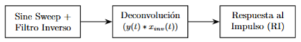
 
***(a)** Etapa de medición y obtención de la Respuesta al Impulso (RI).*
 

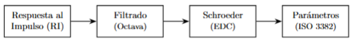
 
***(b)** Etapa de filtrado y cálculo de parámetros acústicos.*
 
**Figura 2:** Flujo completo de trabajo para la obtención y el procesamiento de la señal de audio.
 

### Herramientas utilizadas y decisiones de diseño

En el filtrado se usó el filtro Butterworth, principalmente porque no introduce ringing y conserva fielmente la pendiente real del decaimiento de la sala. También, en lugar de devolver la señal de audio común filtrada, devuelve la envolvente de Hilbert ya suavizada. Se automatizó Lundeby de manera que todos los parámetros se calculan usando esta automatización y aparezca el tiempo de truncamiento. Se agregó un módulo extra de streaming, cuyos endpoints devuelven resultados como eventos Server-Sent Events (SSE) con progreso en tiempo real. 

 

## Resultados

La Figura 3a indica que el ruido rosa generado presenta una caída de -3 dB por octava, como corresponde según la definición de ruido rosa. El sweep logarítmico y su filtro inverso generados se muestran en las Figuras 3b y 3c. 

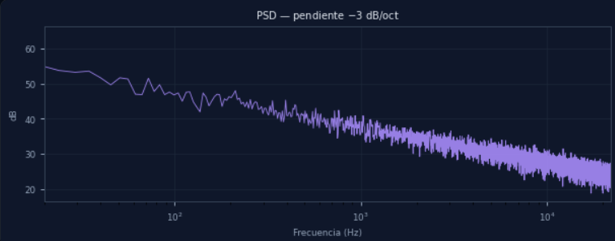
 
***(a)** Ruido rosa generado por el software.*

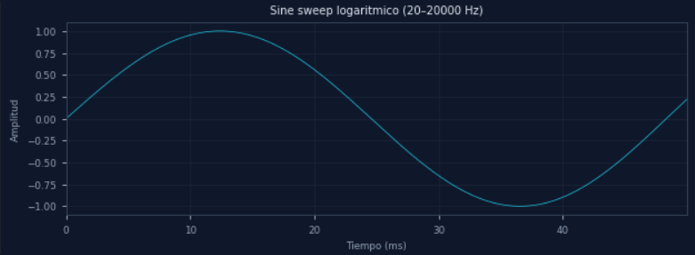
 
***(b)** Sine sweep generado por el software.*

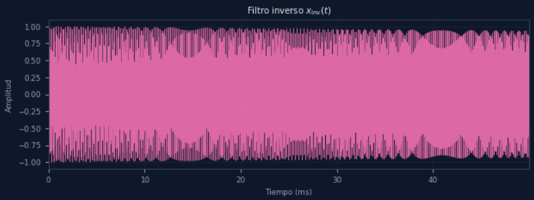
 
***(c)** Filtro inverso generado por el software.*
 
**Figura 3:** Señales de excitación generadas por el software.
 
 
El resultado de la deconvolución proporcionó la respuesta al impulso $$h(t)$$ y la curva de decaimiento $$L(t)$$ (Figuras 4a y 4b).

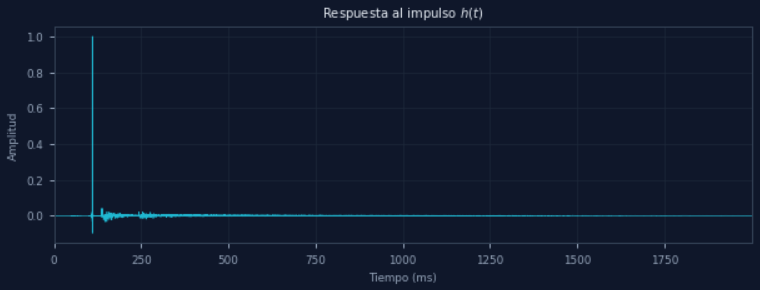
 
***(a)** Respuesta al impulso obtenida por RIR API*

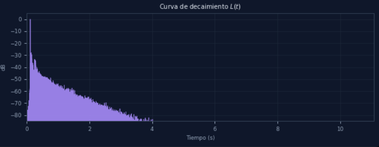
 
***(b)** Curva de decaimiento obtenida por RIR API.*
 
**Figura 4:** Resultados obtenidos por RIR API tras procesamiento.

Las siguientes imagenes reflejan los resultados obtenidos para una señal ingresada. Se obtuvo una curva de Schroeder en la banda de los 1000 Hz donde tanto el $$EDT$$ , el $$T20$$ y $$T30$$ (todas extrapoladas a -60 dB) tienen valores muy cercanos. El gráfico de banco de filtros de octava de la Figura 6 confirma que cada banda cruza a -3 dB en sus flancos. 
 
 
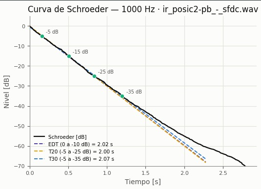
 
**Figura 5:** Curva de Schroeder en la banda de 1000 Hz acotada + regresiones. 
 
 
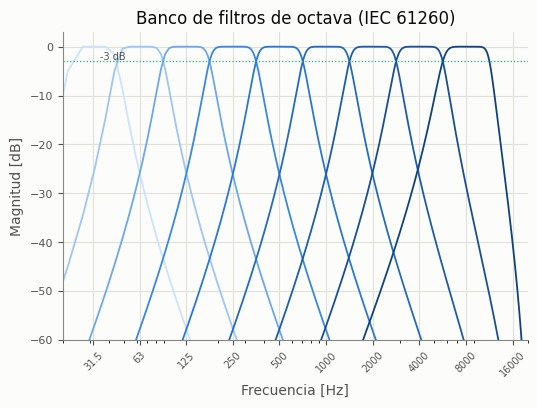
 
**Figura 6:** Banco de filtros de octava (IEC 61260)
 
 
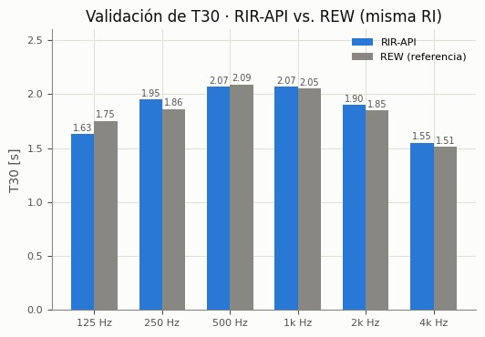
 
**Figura 7:** Validación de T30 RIR-API vs REW (misma RI).
 
 
Se hizo una validación del T30 calculado por RIR API al compararlo con el software REW ante la misma RI. Los resultados obtenidos no difieren en más de +- 0,12 segundos en ninguna banda de frecuencias. El software RIR API muestra alta fiabilidad en los cálculos realizados. 

