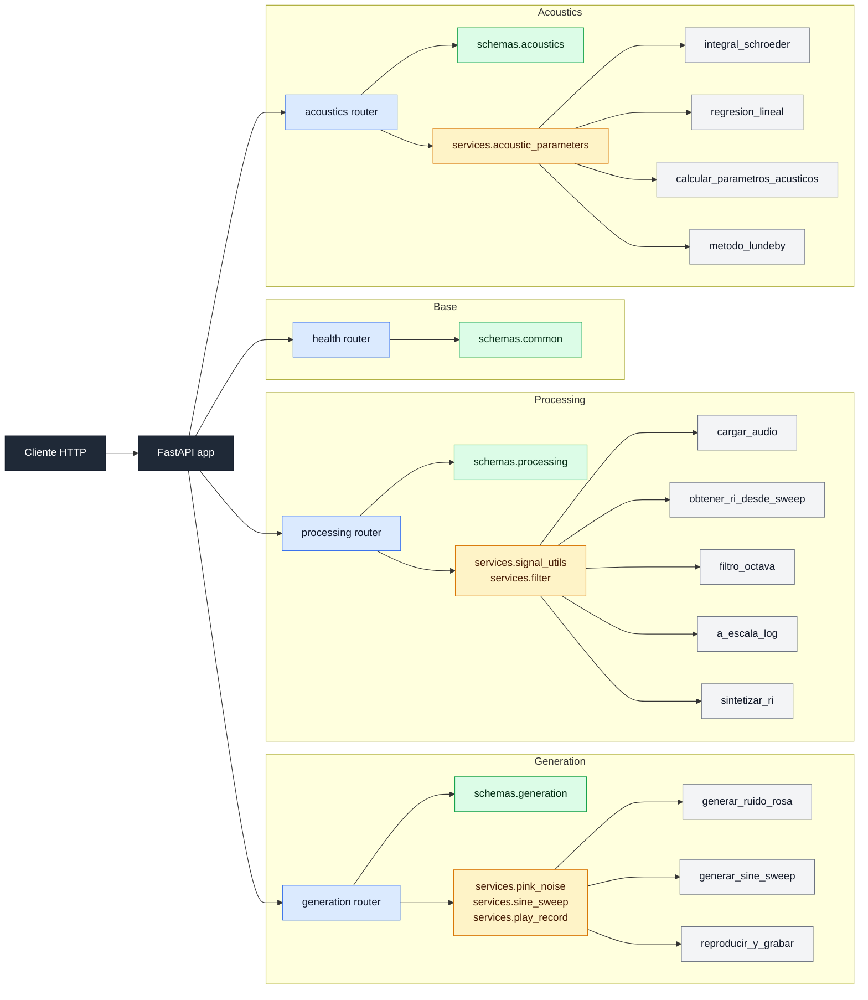

# RIR-API
 
API REST para procesamiento y analisis de respuestas al impulso segun la norma ISO 3382.
 
<!-- Badges -->


 
## Descripción
 
RIR-API es una API REST construida con FastAPI para generar señales de
excitación, procesar respuestas al impulso y calcular parámetros acústicos
según ISO 3382. El proyecto se organiza en capas para separar validación,
lógica de negocio y exposición HTTP desde el inicio del desarrollo.
 
Este repositorio corresponde al plano de arquitectura del sistema. En `M0`
se define la estructura final de routers, schemas y services que se completará
en `M1`, `M2` y `M3`, manteniendo desde ahora una base ejecutable, testeable
y apta para trabajo colaborativo.
 
 
## Integrantes
 
| Nombre completo | Legajo | Rol |
| --- | --- | --- |
| Nahuel Rojo | 77440 | Arquitectura / API |
| Tomás Travaglini | 75714 | Generación de señales/ Procesamiento de RI |
| Lorenzo D'Uva | 78176 | Testing / CI / Documentación |
 
## Requisitos previos
 
- Python 3.12 o superior
- [uv](https://docs.astral.sh/uv/) (gestor de paquetes y entornos virtuales)

## Configuración de audio

Para ejecutar las pruebas de reproducción y grabación en tiempo real
se utilizó la siguiente configuración:

| Parámetro | Valor |
| --- | --- |
| Dispositivo de entrada | Asignador de sonido Microsoft - Input |
| Dispositivo de salida | Asignador de sonido Microsoft - Output |
| Frecuencia de muestreo | 44100 Hz |
| Canales | 1 (mono) |
| Buffer size | 1024 muestras |

> Esta configuración puede variar según el sistema. Ajustar los parámetros
> de `sounddevice` según el hardware disponible antes de ejecutar las pruebas
> de reproducción y grabación.

## Instalación
 
```bash
# Clonar el repositorio
git clone https://github.com/nahueRosso/rir-api.git
cd rir-api
 
# Crear entorno virtual e instalar dependencias
uv venv
uv pip install -e ".[dev]"
```
 
## Ejecución
 
```bash
# Iniciar la API con hot-reload
uvicorn app.main:app --reload
# Iniciar la API con hot-reload
uvicorn app.main:app --reload
```
 
Alternativa:
 
```bash
# O usando el modulo directamente
python -m app.main
# O usando el modulo directamente
python -m app.main
```
 
La API queda disponible en:
 
- `http://localhost:8000/`
- `http://localhost:8000/health`
- `http://localhost:8000/docs`
## Testing y calidad
 
```bash
# Ejecutar todos los tests
uv run pytest -v
 
# Verificar estilo de codigo
uv run ruff check app/ tests/
```

### Nota sobre el test de audio

`test_reproducir_y_grabar_forma` requiere micrófono y parlante disponibles
en el sistema. En CI este test se ejecuta con un mock del dispositivo de audio.

Para correrlo localmente con hardware real:

```bash
uv run pytest tests/test_generation.py::test_reproducir_y_grabar_forma -v
```
 
## Estructura del proyecto
 
```text
rir-api/
├── pyproject.toml                # Dependencias y configuración del proyecto
├── README.md                     # Documentación principal y diagrama de arquitectura
├── LICENSE                       # Licencia del repositorio
├── app/
│   ├── __init__.py
│   ├── main.py                   # Punto de entrada FastAPI
│   ├── settings.py               # Configuración central con pydantic-settings
│   ├── routers/
│   │   ├── __init__.py
│   │   ├── health.py             # Endpoints base: / y /health
│   │   ├── generation.py         # Endpoints de M1
│   │   ├── processing.py         # Endpoints de M2
│   │   └── acoustics.py          # Endpoints de M3
│   ├── schemas/
│   │   ├── __init__.py
│   │   ├── common.py             # Schemas compartidos
│   │   ├── generation.py         # Request/response de generación
│   │   ├── processing.py         # Request/response de procesamiento
│   │   └── acoustics.py          # Request/response de análisis acústico
│   └── services/
│       ├── __init__.py
│       ├── pink_noise.py         # Lógica DSP de ruido rosa
│       ├── sine_sweep.py         # Lógica DSP de sweep logarítmico
│       ├── play_record.py        # Reproducción y grabación de audio
│       ├── play_record.py        # Reproducción y grabación de audio
│       ├── signal_utils.py       # Utilidades de audio y RI
│       ├── filter.py             # Filtrado por bandas de octava
│       └── acoustic_parameters.py# Cálculo de parámetros ISO 3382
├── tests/
│   ├── test_api.py               # Tests de endpoints base
│   ├── test_placeholder.py       # Test mínimo que debe pasar en M0
│   ├── test_generation.py        # Tests de generación de señales (M1)
│   └── test_procesamiento.py     # Tests de procesamiento de RI (M2)
├── docs/                         # Documentación adicional
├── data/
│   └── .gitkeep                  # Directorio reservado para datos locales
└── .github/workflows/ci.yml      # Pipeline de CI
```
 
## Arquitectura
 
La API se separa en tres capas:
 
- `routers`: reciben requests HTTP, documentan endpoints y delegan.
- `schemas`: validan requests y responses con Pydantic.
- `services`: concentran la lógica de negocio y DSP.
Los módulos principales quedan divididos por dominio:
 
- `generation`: generación de ruido rosa, sweep y flujo de reproducción/grabación.
- `processing`: carga de audio, obtención de RI, filtrado por octava,
  escala logarítmica y síntesis de RI.
- `acoustics`: integral de Schroeder, regresión lineal y cálculo de parámetros acústicos.
## Diagrama de arquitectura
 

 
## Flujo de datos
 
1. El cliente envía un request HTTP a un endpoint.
2. FastAPI valida el cuerpo y los parámetros usando un schema Pydantic.
3. El router delega la operación al service correspondiente.
4. El service produce datos procesados.
5. El router devuelve una respuesta JSON validada por un schema de salida.
**Inputs esperados:** archivos de audio, arrays numéricos y configuraciones de medición.  
**Outputs esperados:** respuestas al impulso, curvas de decaimiento y parámetros acústicos calculados.

## Endpoints

### Base
- `GET /` — Estado general de la API
- `GET /health` — Health check

### M1 — Generation

#### `POST /api/v1/generation/pink-noise`
Genera una señal de ruido rosa.

**Request body:**
```json
{
  "duracion": 1,
  "fs": 44100,
  "guardar_audio": true,
  "nombre_archivo": "ruido_rosa.wav",
  "incluir_muestras": true,
  "max_points": 1000
}
```

**Response 200:**
```json
{
  "tipo": "pink_noise",
  "duracion": 0,
  "fs": 0,
  "audio": {
    "duracion": 0,
    "cantidad_muestras": 0,
    "cantidad_canales": 0,
    "normalizada": true,
    "valor_maximo_absoluto": 0,
    "audio_path": "string",
    "nombre_archivo": "string",
    "audio_url": "string",
    "amplitud": [0],
    "channels": [[0]]
  },
  "samples_reducidos": false,
  "max_points": 0
}
```

---

#### `POST /api/v1/generation/sine-sweep`
Genera un sine sweep logarítmico y su filtro inverso.

**Request body:**
```json
{
  "frecuencia_inicial": 1,
  "frecuencia_final": 1,
  "duracion": 0,
  "fs": 44100,
  "tipo_barrido": "logaritmico",
  "guardar_audio": true,
  "nombre_archivo": "sine_sweep.wav",
  "guardar_filtro_inverso": true,
  "nombre_archivo_filtro_inverso": "sine_sweep_inverso.wav",
  "incluir_muestras": true,
  "max_points": 1000
}
```

**Response 200:**
```json
{
  "tipo": "sine_sweep",
  "frecuencia_inicial": 0,
  "frecuencia_final": 0,
  "duracion": 0,
  "fs": 0,
  "tipo_barrido": "lineal",
  "sweep": {
    "duracion": 0,
    "cantidad_muestras": 0,
    "cantidad_canales": 0,
    "normalizada": true,
    "valor_maximo_absoluto": 0,
    "audio_path": "string",
    "nombre_archivo": "string",
    "audio_url": "string",
    "amplitud": [0],
    "channels": [[0]]
  },
  "samples_reducidos": false,
  "max_points": 0
}
```

---

#### `GET /api/v1/generation/device`
Consulta los dispositivos de audio disponibles en el sistema.

**Response 200:**
```json
{
  "default_input_device": 0,
  "default_output_device": 0,
  "devices": [{}]
}
```

---

#### `GET /api/v1/generation/audio/{nombre_archivo}`
Descarga un archivo de audio generado previamente.

**Parámetro de ruta:** `nombre_archivo` (string) — nombre del archivo a descargar.

**Response 200:** archivo de audio descargable.

---

#### `GET /api/v1/generation/audio/{nombre_archivo}/samples`
Obtiene las muestras de un archivo de audio en formato JSON.

**Parámetro de ruta:** `nombre_archivo` (string) — nombre del archivo.

**Response 200:**
```json
{
  "fs": 0,
  "duracion": 0,
  "cantidad_muestras": 0,
  "cantidad_canales": 0,
  "normalizada": true,
  "valor_maximo_absoluto": 0,
  "audio_path": "string",
  "nombre_archivo": "string",
  "audio_url": "string",
  "amplitud": [0],
  "channels": [[0]],
  "samples_reducidos": false,
  "max_points": 0
}
```

---

#### `POST /api/v1/generation/play-record`
Reproduce una señal y graba simultáneamente.

**Request body:**
```json
{
  "signal": [0],
  "fs": 44100,
  "duracion_grabacion": 0,
  "guardar_audio": true,
  "nombre_archivo": "grabacion.wav",
  "incluir_muestras": true,
  "max_points": 1000
}
```

**Response 200:**
```json
{
  "tipo": "play_record",
  "fs": 0,
  "duracion_grabacion": 0,
  "senal_entrada": {
    "duracion": 0,
    "cantidad_muestras": 0,
    "cantidad_canales": 0,
    "normalizada": true,
    "valor_maximo_absoluto": 0,
    "audio_path": "string",
    "nombre_archivo": "string",
    "audio_url": "string",
    "amplitud": [0],
    "channels": [[0]]
  },
  "samples_reducidos": false,
  "max_points": 0
}
```

---

### Grabación local y desde frontend

La API soporta dos flujos distintos para trabajar con grabaciones:

- grabación local en la máquina donde corre el backend;
- upload de un archivo grabado previamente desde un frontend web.

#### Flujo 1: grabación local con el backend

1. Iniciar la grabación con `POST /api/v1/generation/recording/start`.
2. Consultar el estado con `GET /api/v1/generation/recording/status`.
3. Si hace falta detenerla manualmente, usar `POST /api/v1/generation/recording/stop`.
4. Descargar el archivo resultante con `GET /api/v1/generation/audio/{nombre_archivo}`.

Ejemplo de inicio:
```json
{
  "fs": 44100,
  "canales": 1,
  "input_device": 1,
  "nombre_archivo": "grabacion_m1.wav",
  "auto_stop_seconds": 60
}
```

Detalles del flujo:

- `recording/start` inicia una captura con `sounddevice.InputStream`.
- `recording/status` devuelve si la grabación sigue activa, la duración actual y el último archivo guardado.
- `recording/stop` es útil si se quiere cortar antes del límite configurado.
- Si `auto_stop_seconds` vence, la grabación se detiene sola y se guarda automáticamente.

Ejemplo de respuesta de `GET /api/v1/generation/recording/status`:
```json
{
  "recording": false,
  "fs": 44100,
  "canales": 1,
  "input_device": 1,
  "nombre_archivo": null,
  "duracion_actual": 0,
  "auto_stop_seconds": null,
  "ultimo_archivo_guardado": "grabacion_m1.wav",
  "ultimo_motivo_fin": "auto_stop",
  "ultima_duracion_grabada": 60.0
}
```

Ejemplo para detener manualmente:
```json
{
  "guardar_audio": true,
  "incluir_samples": true,
  "max_points": 2000
}
```

Luego el archivo puede descargarse desde:

- `GET /api/v1/generation/audio/grabacion_m1.wav`

#### Flujo 2: grabación desde un frontend web

Si el audio se captura en el navegador, el backend no controla el micrófono directamente. En ese caso el frontend debe enviar el archivo ya grabado a:

- `POST /api/v1/generation/upload-recording`

Este endpoint recibe `multipart/form-data` con:

- `file`: archivo de audio grabado;
- `nombre_archivo`: opcional, para forzar el nombre final guardado en `data/`.

Ejemplo con `curl`:
```bash
curl -X POST http://127.0.0.1:8000/api/v1/generation/upload-recording \
  -F "file=@grabacion.webm" \
  -F "nombre_archivo=grabacion_frontend.webm"
```

Una vez subido, el archivo queda disponible para descarga mediante:

- `GET /api/v1/generation/audio/grabacion_frontend.webm`

---

### M2 — Processing

> Los schemas de request y response de esta sección son provisorios y se
> actualizarán cuando la lógica de cada endpoint esté completamente implementada.

#### `POST /api/v1/processing/load-audio`
Carga un archivo de audio WAV o FLAC y devuelve la señal normalizada.

**Request body:**
```json
{
  "ruta": "audio/respuesta_sala.wav",
  "incluir_muestras": true,
  "max_points": 1000
}
```

**Response 200:**
```json
{
  "fs": 44100,
  "duracion": 0,
  "cantidad_muestras": 0,
  "cantidad_canales": 1,
  "normalizada": true,
  "valor_maximo_absoluto": 0,
  "audio_path": "string",
  "nombre_archivo": "string",
  "amplitud": [0],
  "channels": [[0]],
  "samples_reducidos": false,
  "max_points": 0
}
```

---

#### `POST /api/v1/processing/impulse-response-from-sweep`
Obtiene la respuesta al impulso de una sala mediante deconvolución.

**Request body:**
```json
{
  "nombre_grabacion": "grabacion_sala.wav",
  "nombre_filtro_inverso": "sine_sweep_inverso.wav",
  "guardar_audio": true,
  "nombre_archivo": "ri_sala.wav",
  "incluir_muestras": true,
  "max_points": 1000
}
```

**Response 200:**
```json
{
  "tipo": "impulse_response",
  "fs": 44100,
  "duracion": 0,
  "cantidad_muestras": 0,
  "normalizada": true,
  "audio_path": "string",
  "nombre_archivo": "string",
  "audio_url": "string",
  "amplitud": [0],
  "channels": [[0]],
  "samples_reducidos": false,
  "max_points": 0
}
```

---

#### `POST /api/v1/processing/octave-filter`
Aplica un filtro pasa-banda de octava según IEC 61260.

**Request body:**
```json
{
  "nombre_archivo": "ri_sala.wav",
  "fc": 1000,
  "orden": 4,
  "guardar_audio": true,
  "nombre_archivo_salida": "ri_1000hz.wav",
  "incluir_muestras": true,
  "max_points": 1000
}
```

**Response 200:**
```json
{
  "tipo": "octave_filter",
  "fc": 1000,
  "f_inferior": 707.1,
  "f_superior": 1414.2,
  "orden": 4,
  "fs": 44100,
  "duracion": 0,
  "cantidad_muestras": 0,
  "normalizada": true,
  "audio_path": "string",
  "nombre_archivo": "string",
  "amplitud": [0],
  "channels": [[0]],
  "samples_reducidos": false,
  "max_points": 0
}
```

---

#### `POST /api/v1/processing/log-scale`
Convierte una señal a escala logarítmica normalizada (dB).

**Request body:**
```json
{
  "nombre_archivo": "ri_1000hz.wav",
  "incluir_muestras": true,
  "max_points": 1000
}
```

**Response 200:**
```json
{
  "tipo": "log_scale",
  "fs": 44100,
  "duracion": 0,
  "cantidad_muestras": 0,
  "valor_maximo_db": 0,
  "amplitud_db": [0],
  "samples_reducidos": false,
  "max_points": 0
}
```

---

#### `POST /api/v1/processing/synthesize-ri`
Sintetiza una respuesta al impulso artificial con valores de T60 conocidos por banda.

**Request body:**
```json
{
  "t60_por_banda": {
    "125": 2.0,
    "250": 1.8,
    "500": 1.5,
    "1000": 1.2,
    "2000": 1.0,
    "4000": 0.8
  },
  "fs": 44100,
  "duracion": 3.0,
  "guardar_audio": true,
  "nombre_archivo": "ri_sintetizada.wav",
  "incluir_muestras": true,
  "max_points": 1000
}
```

**Response 200:**
```json
{
  "tipo": "synthesized_ri",
  "fs": 44100,
  "duracion": 0,
  "cantidad_muestras": 0,
  "t60_por_banda": {
    "125": 2.0,
    "250": 1.8,
    "500": 1.5,
    "1000": 1.2,
    "2000": 1.0,
    "4000": 0.8
  },
  "normalizada": true,
  "audio_path": "string",
  "nombre_archivo": "string",
  "audio_url": "string",
  "amplitud": [0],
  "channels": [[0]],
  "samples_reducidos": false,
  "max_points": 0
}
```

---

### M3 — Acoustics *(pendiente)*
- `POST /api/v1/acoustics/schroeder`
- `POST /api/v1/acoustics/linear-regression`
- `POST /api/v1/acoustics/parameters`
- `POST /api/v1/acoustics/lundeby`

## Validación M1

Las siguientes validaciones manuales fueron realizadas al completar el milestone.

### Espectro del ruido rosa

<!-- TODO: agregar captura del espectro en Audacity o REW mostrando la pendiente de -3 dB/octava -->

### Espectrograma del sine sweep

<!-- TODO: agregar captura del espectrograma mostrando el barrido logarítmico de f1 a f2 -->

### Convolución sweep × filtro inverso

<!-- TODO: agregar gráfica del resultado de la convolución mostrando el impulso -->

### Prueba de reproducción y grabación

<!-- TODO: agregar captura o gráfica de la prueba real con altavoz y micrófono -->

## Validación M2

Las siguientes validaciones manuales fueron realizadas al completar el milestone.

### RIs de referencia — OpenAIR

<!-- TODO: agregar capturas del procesamiento de las RIs descargadas de OpenAIR -->

### Comparación con software de referencia (REW / ARTA)

<!-- TODO: agregar comparación de resultados con REW o ARTA -->

## Branching strategy
 
- `main` protegida — merge solo vía pull request.
- Cada desarrollo nuevo sale de una rama `feature/nombre-descriptivo`.
- Commits siguiendo Conventional Commits:
  - `feat(routers): add generation placeholder endpoints`
  - `docs(readme): document architecture and milestones`
  - `test(api): add milestone 0 placeholder test`
## Estado de los milestones
 
| Milestone | Estado | Fecha |
| --- | --- | --- |
| M0 — Arquitectura | ✅ Completado | 28 Abr 2026 |
| M1 — Generación de señales | ✅ Completado | 19 May 2026 |
| M2 — Procesamiento de RI | 🔄 En curso | 16 Jun 2026 |
| M3 — Producto final | Pendiente | 7 Jul 2026 |
