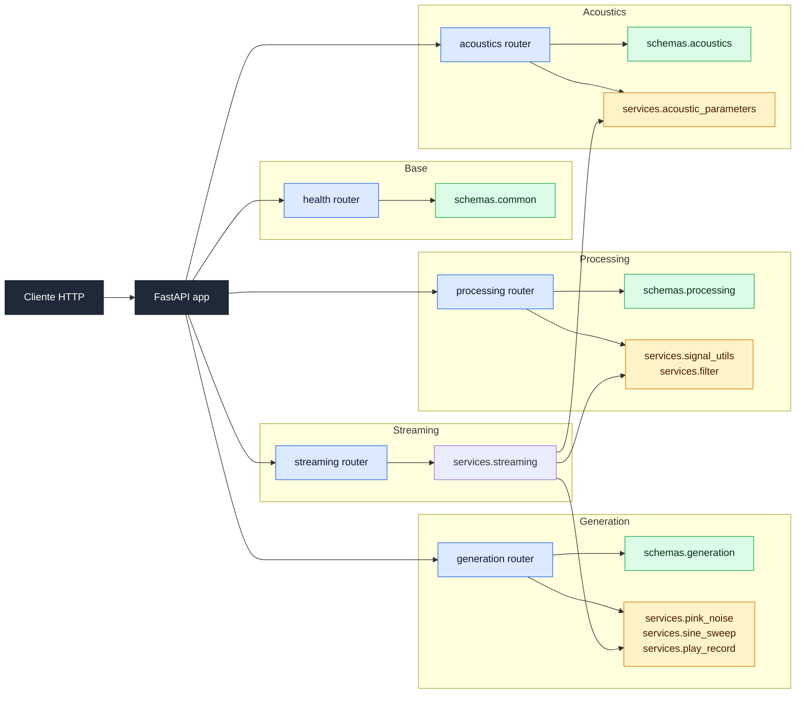
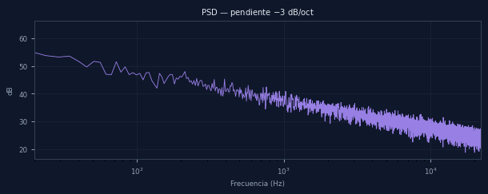
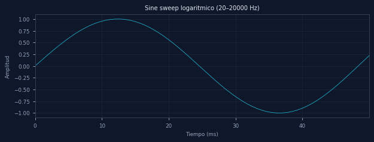
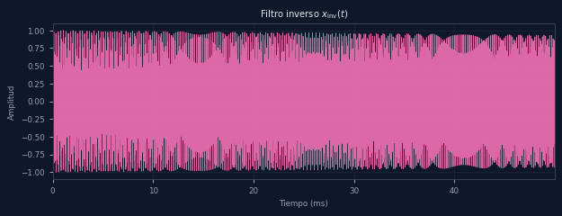
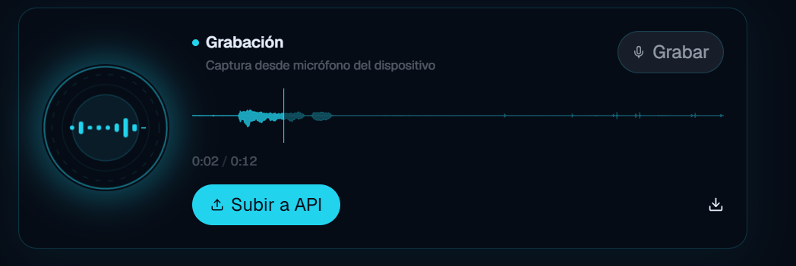
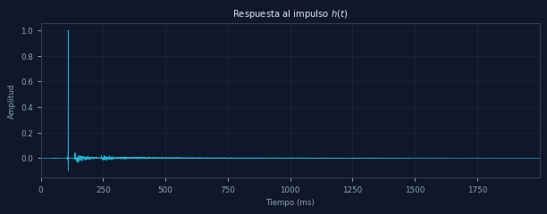
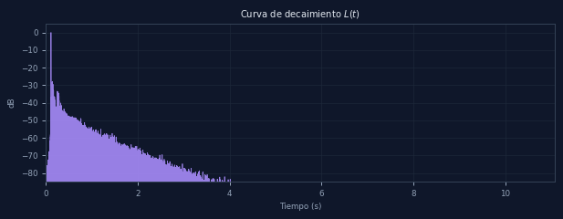
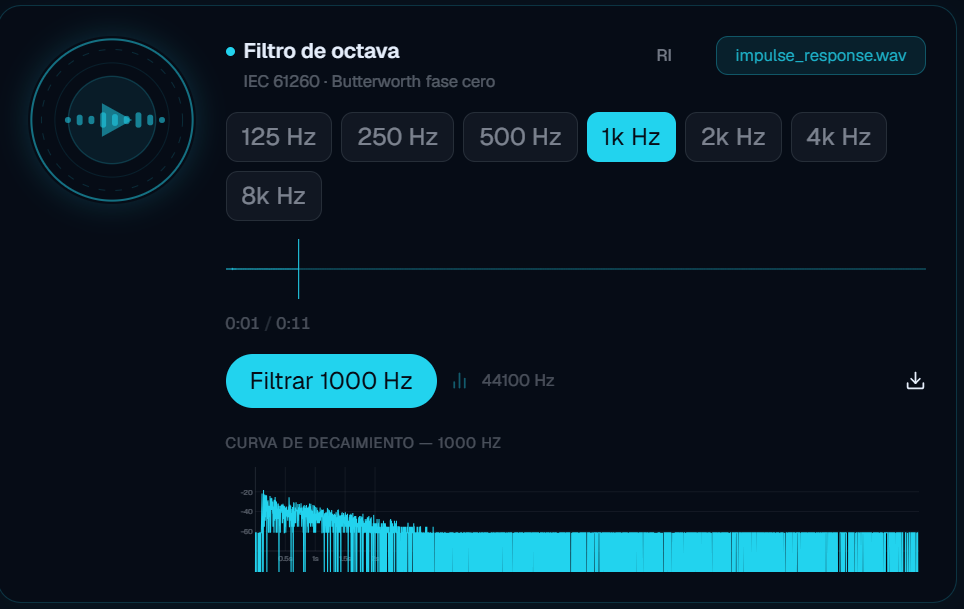

# RIR-API

API REST para procesamiento y analisis de respuestas al impulso segun la norma ISO 3382.

<!-- Badges -->


## Descripción

RIR-API es una API REST construida con FastAPI para generar señales de
excitación, procesar respuestas al impulso y calcular parámetros acústicos
según ISO 3382. El proyecto se organiza en capas para separar validación,
lógica de negocio y exposición HTTP desde el inicio del desarrollo.

## Integrantes

| Nombre completo | Legajo | Rol |
| --- | --- | --- |
| Nahuel Rojo | 77440 | Arquitectura / API |
| Tomás Travaglini | 75714 | Procesamiento de RI / DSP |
| Lorenzo D'Uva | 78176 | Testing / CI / Documentación |

## Requisitos previos

- Python 3.12 o superior
- [uv](https://docs.astral.sh/uv/) (gestor de paquetes y entornos virtuales)

## Configuración de audio

Para ejecutar las pruebas de reproducción y grabación en tiempo real
se utilizó la siguiente configuración:

| Parámetro | Valor |
| --- | --- |
| Dispositivo de entrada | Asignador de sonido Microsoft - Input |
| Dispositivo de salida | Asignador de sonido Microsoft - Output |
| Frecuencia de muestreo | 44100 Hz |
| Canales | 1 (mono) |
| Buffer size | 1024 muestras |

> Esta configuración puede variar según el sistema. Usar `GET /api/v1/generation/device`
> para consultar los dispositivos disponibles antes de ejecutar las pruebas.

## Instalación

```bash
git clone https://github.com/nahueRosso/rir-api.git
cd rir-api
uv venv
uv pip install -e ".[dev]"
```

## Ejecución

```bash
uvicorn app.main:app --reload
```

La API queda disponible en:

- `http://localhost:8000/`
- `http://localhost:8000/health`
- `http://localhost:8000/docs`

## Testing y calidad

```bash
uv run pytest -v
uv run ruff check app/ tests/
```

### Nota sobre el test de audio

`test_reproducir_y_grabar_forma` requiere micrófono y parlante disponibles
en el sistema. En CI este test se ejecuta con un mock del dispositivo de audio.

Para correrlo localmente con hardware real:

```bash
uv run pytest tests/test_generation.py::test_reproducir_y_grabar_forma -v
```

## Estructura del proyecto

```text
rir-api/
├── pyproject.toml
├── README.md
├── LICENSE
├── app/
│   ├── main.py
│   ├── settings.py
│   ├── routers/
│   │   ├── health.py
│   │   ├── generation.py
│   │   ├── processing.py
│   │   ├── acoustics.py
│   │   └── streaming.py
│   ├── schemas/
│   │   ├── common.py
│   │   ├── generation.py
│   │   ├── processing.py
│   │   └── acoustics.py
│   └── services/
│       ├── pink_noise.py
│       ├── sine_sweep.py
│       ├── play_record.py
│       ├── signal_utils.py
│       ├── filter.py
│       ├── acoustic_parameters.py
│       └── streaming.py
├── tests/
│   ├── test_api.py
│   ├── test_placeholder.py
│   ├── test_generacion.py
│   ├── test_procesamiento.py
│   ├── test_analisis.py
│   ├── test_play_record.py
│   └── test_streaming.py
├── docs/
│   └── validacion/
└── .github/workflows/ci.yml
```

## Arquitectura



## Endpoints

### Base

#### `GET /health`
Estado de salud de la API.

**Response 200:**
```json
{
  "status": "healthy",
  "version": "0.1.0"
}
```

---

### Generation

#### `POST /api/v1/generation/pink-noise`
Genera ruido rosa y devuelve un archivo WAV.

**Request body:**
```json
{
  "duracion": 1,
  "fs": 44100
}
```

**Response 200:** archivo WAV (`audio/wav`)

---

#### `POST /api/v1/generation/sine-sweep`
Genera sine sweep y devuelve un archivo WAV.

**Request body:**
```json
{
  "frecuencia_inicial": 20,
  "frecuencia_final": 20000,
  "duracion": 5,
  "fs": 44100,
  "tipo_barrido": "logaritmico"
}
```

**Response 200:** archivo WAV (`audio/wav`)

---

#### `POST /api/v1/generation/sine-sweep/inverse-filter`
Genera el filtro inverso del sine sweep.

**Request body:**
```json
{
  "frecuencia_inicial": 20,
  "frecuencia_final": 20000,
  "duracion": 5,
  "fs": 44100,
  "tipo_barrido": "logaritmico"
}
```

**Response 200:** archivo WAV (`audio/wav`)

---

#### `POST /api/v1/generation/upload-recording`
Recibe una grabación del navegador y la devuelve.

**Request body:** `multipart/form-data`
- `file` (required): archivo de audio grabado

**Response 200:** archivo de audio

---

#### `POST /api/v1/generation/samples`
Extrae muestras de un audio para visualización.

**Query params:** `n_puntos` (default: 2000, max: 10000, min: 100)

**Request body:** `multipart/form-data`
- `file` (required): archivo de audio

**Response 200:**
```json
{
  "fs": 0,
  "duracion": 0,
  "n_canales": 0,
  "samples_reducidos": true,
  "amplitud": [0],
  "channels": [[0]]
}
```

---

#### `GET /api/v1/generation/device`
Consulta los dispositivos de audio disponibles en el sistema.

**Response 200:**
```json
{
  "default_input_device": 0,
  "default_output_device": 0,
  "devices": [{}]
}
```

---

#### `GET /api/v1/generation/recording/status`
Estado actual de la grabación en curso.

**Response 200:**
```json
{
  "recording": true,
  "canales": 0,
  "fs": 0,
  "input_device": 0,
  "nombre_archivo": "string",
  "duracion_actual": 0,
  "auto_stop_seconds": 0,
  "ultimo_archivo_guardado": "string",
  "ultima_motivo_fin": "string",
  "ultima_duracion_grabada": 0
}
```

---

#### `POST /api/v1/generation/recording/start`
Inicia una grabación desde el servidor.

**Request body:**
```json
{
  "fs": 44100,
  "input_device": 0,
  "nombre_archivo": "grabacion_manual.wav",
  "auto_stop_seconds": 60
}
```

**Response 200:**
```json
{
  "tipo": "recording_started",
  "estado": {
    "recording": true,
    "fs": 0,
    "canales": 0,
    "input_device": 0,
    "nombre_archivo": "string",
    "duracion_actual": 0,
    "auto_stop_seconds": 0,
    "ultimo_archivo_guardado": "string",
    "ultima_motivo_fin": "string",
    "ultima_duracion_grabada": 0
  }
}
```

---

#### `POST /api/v1/generation/recording/stop`
Detiene la grabación del servidor y devuelve el archivo WAV.

**Response 200:** archivo WAV (`audio/wav`)

---

### Processing

#### `POST /api/v1/processing/impulse-response`
Deconvolución: grabación + filtro inverso → respuesta al impulso.

**Request body:** `multipart/form-data`
- `grabacion` (required): WAV de la grabación del sweep en la sala
- `filtro_inverso` (required): WAV del filtro inverso del sweep

**Response 200:** archivo WAV (`audio/wav`)

---

#### `POST /api/v1/processing/octave-filter`
Filtra la RI por banda de octava.

**Query params:**
- `fc` (required): frecuencia central de la banda en Hz
- `orden` (default: 4, min: 1, max: 10)

**Request body:** `multipart/form-data`
- `file` (required): archivo WAV de la RI

**Response 200:** archivo WAV (`audio/wav`)

---

#### `POST /api/v1/processing/log-scale`
Convierte la RI a escala logarítmica (dB).

**Query params:** `n_puntos` (default: 4000, max: 30000, min: 100)

**Request body:** `multipart/form-data`
- `file` (required): archivo WAV de la RI

**Response 200:**
```json
{
  "fs": 0,
  "duracion": 0,
  "n_muestras": 0,
  "tiempo": [0],
  "db": [0]
}
```

---

#### `POST /api/v1/processing/synthesize-ri`
Sintetiza una RI con T60 conocidos por banda.

**Request body:**
```json
{
  "t60_por_banda": {
    "125": 2.0,
    "250": 1.8,
    "500": 1.5,
    "1000": 1.2,
    "2000": 1.0,
    "4000": 0.8
  },
  "fs": 44100,
  "duracion": 3
}
```

**Response 200:** archivo WAV (`audio/wav`)

---

### Acoustics

#### `POST /api/v1/acoustics/smoothing`
Suaviza una señal con envolvente de Hilbert o media móvil.

**Query params:** `ventana` (default: "hilbert" — o un entero para el tamaño de la ventana en muestras)

**Request body:** `multipart/form-data`
- `file` (required): archivo WAV

**Response 200:**
```json
{
  "fs": 0,
  "ventana": "string",
  "tiempo": [0],
  "envolvente": [0]
}
```

---

#### `POST /api/v1/acoustics/schroeder`
Calcula la integral de Schroeder (curva de decaimiento en dB).

**Request body:** `multipart/form-data`
- `file` (required): archivo WAV de la RI

**Response 200:**
```json
{
  "fs": 0,
  "tiempo": [0],
  "edc_db": [0]
}
```

---

#### `POST /api/v1/acoustics/linear-regression`
Calcula la regresión lineal por mínimos cuadrados.

**Request body:**
```json
{
  "x": [0],
  "y": [0]
}
```

**Response 200:**
```json
{
  "pendiente": 0,
  "ordenada_al_origen": 0,
  "r_cuadrado": 0
}
```

---

#### `POST /api/v1/acoustics/parameters`
Calcula los parámetros acústicos ISO 3382 por banda de octava.

**Request body:** `multipart/form-data`
- `file` (required): archivo WAV de la RI

**Response 200:**
```json
{
  "fs": 0,
  "parametros": {
    "T20": {"125": 0, "250": 0, "500": 0, "1000": 0, "2000": 0, "4000": 0},
    "T30": {"125": 0, "250": 0, "500": 0, "1000": 0, "2000": 0, "4000": 0},
    "EDT": {"125": 0, "250": 0, "500": 0, "1000": 0, "2000": 0, "4000": 0},
    "C50": {"125": 0, "250": 0, "500": 0, "1000": 0, "2000": 0, "4000": 0},
    "C80": {"125": 0, "250": 0, "500": 0, "1000": 0, "2000": 0, "4000": 0},
    "D50": {"125": 0, "250": 0, "500": 0, "1000": 0, "2000": 0, "4000": 0}
  }
}
```

---

#### `POST /api/v1/acoustics/lundeby`
Estima el truncamiento de la RI por el método de Lundeby.

**Request body:** `multipart/form-data`
- `file` (required): archivo WAV de la RI

**Response 200:**
```json
{
  "fs": 0,
  "indice_truncamiento": 0,
  "tiempo_truncamiento": 0,
  "nivel_ruido_db": 0
}
```

---

### Streaming

Los endpoints de streaming devuelven el resultado como un evento Server-Sent Events (SSE)
con progreso en tiempo real.

#### `POST /api/v1/streaming/desconvolucionar`
Deconvolución con progreso en tiempo real.

**Request body:** `multipart/form-data`
- `grabacion` (required): WAV de la grabación del sweep
- `filtro_inverso` (required): WAV del filtro inverso

**Response 200:** SSE stream

---

#### `POST /api/v1/streaming/filtrar-bandas`
Filtra la RI por bandas de octava con progreso.

**Request body:** `multipart/form-data`
- `file` (required): WAV de la respuesta al impulso
- `bandas`: bandas de octava separadas por coma (Hz), ej: `125,250,500,1000,2000,4000`

**Response 200:** SSE stream

---

#### `POST /api/v1/streaming/generar-sweep`
Genera sine sweep con progreso en tiempo real.

**Request body:** `application/x-www-form-urlencoded`
- `f1`: frecuencia inicial (Hz)
- `f2`: frecuencia final (Hz)
- `duracion`: duración (s)
- `fs`: frecuencia de muestreo (Hz)
- `tipo`: `"logaritmico"` o `"lineal"`

**Response 200:** SSE stream

---

#### `POST /api/v1/streaming/generar-ruido-rosa`
Genera ruido rosa con progreso en tiempo real.

**Request body:** `application/x-www-form-urlencoded`
- `duracion`: duración (s)
- `fs`: frecuencia de muestreo (Hz)

**Response 200:** SSE stream

---

## Validación M1

### Espectro del ruido rosa



### Sine sweep — forma de onda y filtro inverso





### Prueba de reproducción y grabación



## Validación M2

### Respuesta al impulso h(t)



### Curva de decaimiento L(t)



### Filtro de octava — banda de 1000 Hz



## Validación M3

### Parámetros acústicos — RI de referencia (OpenAIR)

<!-- TODO: agregar tabla de parámetros T20, T30, EDT, C50, C80, D50 comparados con REW/ARTA -->

## Branching strategy

- `main` protegida — merge solo vía pull request.
- Cada desarrollo nuevo sale de una rama `feature/nombre-descriptivo`.
- Commits siguiendo Conventional Commits.

## Estado de los milestones

| Milestone | Estado | Fecha |
| --- | --- | --- |
| M0 — Arquitectura | ✅ Completado | 28 Abr 2026 |
| M1 — Generación de señales | ✅ Completado | 19 May 2026 |
| M2 — Procesamiento de RI | ✅ Completado | 16 Jun 2026 |
| M3 — Producto final | ✅ Completado | 7 Jul 2026 |
