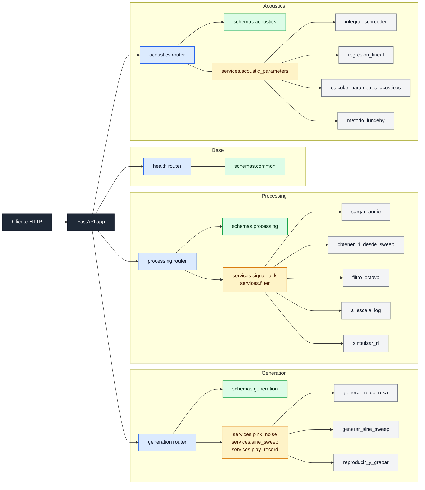

# RIR-API

API REST para procesamiento y analisis de respuestas al impulso segun la norma ISO 3382.

<!-- Badges -->


## Descripción

RIR-API es una API REST construida con FastAPI para generar señales de
excitación, procesar respuestas al impulso y calcular parámetros acústicos
según ISO 3382. El proyecto se organiza en capas para separar validación,
lógica de negocio y exposición HTTP desde el inicio del desarrollo.

Este repositorio corresponde al plano de arquitectura del sistema. En `M0`
se define la estructura final de routers, schemas y services que se completará
en `M1`, `M2` y `M3`, manteniendo desde ahora una base ejecutable, testeable
y apta para trabajo colaborativo.


## Integrantes

| Nombre completo | Legajo | Rol |
| --- | --- | --- |
| Nahuel Rojo | 77440 | Arquitectura / API |
| Lautaro Ibáñez | 74262 | Generación de señales |
| Tomás Travaglini | 75714 | Procesamiento de RI |
| Lorenzo D'Uva | 78176 | Testing / CI / Documentación |

## Requisitos previos

- Python 3.12 o superior
- [uv](https://docs.astral.sh/uv/) (gestor de paquetes y entornos virtuales)

## Configuración de audio

Para ejecutar las pruebas de reproducción y grabación en tiempo real
se utilizó la siguiente configuración:

| Parámetro | Valor |
| --- | --- |
| Dispositivo de entrada | <!-- TODO: completar con nombre del micrófono --> |
| Dispositivo de salida | <!-- TODO: completar con nombre del parlante/auricular --> |
| Frecuencia de muestreo | 44100 Hz |
| Canales | 1 (mono) |
| Buffer size | <!-- TODO: completar con valor en muestras, ej. 1024 --> |

> Esta configuración puede variar según el sistema. Ajustar los parámetros
> de `sounddevice` según el hardware disponible antes de ejecutar las pruebas
> de reproducción y grabación.

## Instalación

```bash
# Clonar el repositorio
git clone https://github.com/nahueRosso/rir-api.git
cd rir-api

# Crear entorno virtual e instalar dependencias
uv venv
uv pip install -e ".[dev]"
```

## Ejecución

```bash
# Iniciar la API con hot-reload
uvicorn app.main:app --reload
```

Alternativa:

```bash
# O usando el modulo directamente
python -m app.main
```

La API queda disponible en:

- `http://localhost:8000/`
- `http://localhost:8000/health`
- `http://localhost:8000/docs`

## Testing y calidad

```bash
# Ejecutar todos los tests
uv run pytest -v

# Verificar estilo de codigo
uv run ruff check app/ tests/
```

### Nota sobre el test de audio

`test_reproducir_y_grabar_forma` requiere micrófono y parlante disponibles
en el sistema. En CI este test se ejecuta con un mock del dispositivo de audio.

Para correrlo localmente con hardware real:

```bash
uv run pytest tests/test_generation.py::test_reproducir_y_grabar_forma -v
```

## Estructura del proyecto

```text
rir-api/
├── pyproject.toml                # Dependencias y configuración del proyecto
├── README.md                     # Documentación principal y diagrama de arquitectura
├── LICENSE                       # Licencia del repositorio
├── app/
│   ├── __init__.py
│   ├── main.py                   # Punto de entrada FastAPI
│   ├── settings.py               # Configuración central con pydantic-settings
│   ├── routers/
│   │   ├── __init__.py
│   │   ├── health.py             # Endpoints base: / y /health
│   │   ├── generation.py         # Endpoints de M1
│   │   ├── processing.py         # Endpoints de M2
│   │   └── acoustics.py          # Endpoints de M3
│   ├── schemas/
│   │   ├── __init__.py
│   │   ├── common.py             # Schemas compartidos
│   │   ├── generation.py         # Request/response de generación
│   │   ├── processing.py         # Request/response de procesamiento
│   │   └── acoustics.py          # Request/response de análisis acústico
│   └── services/
│       ├── __init__.py
│       ├── pink_noise.py         # Lógica DSP de ruido rosa
│       ├── sine_sweep.py         # Lógica DSP de sweep logarítmico
│       ├── play_record.py        # Reproducción y grabación de audio
│       ├── signal_utils.py       # Utilidades de audio y RI
│       ├── filter.py             # Filtrado por bandas de octava
│       └── acoustic_parameters.py# Cálculo de parámetros ISO 3382
├── tests/
│   ├── test_api.py               # Tests de endpoints base
│   ├── test_placeholder.py       # Test mínimo que debe pasar en M0
│   └── test_generation.py        # Tests de generación de señales (M1)
├── docs/                         # Documentación adicional
├── data/
│   └── .gitkeep                  # Directorio reservado para datos locales
└── .github/workflows/ci.yml      # Pipeline de CI
```

## Arquitectura

La API se separa en tres capas:

- `routers`: reciben requests HTTP, documentan endpoints y delegan.
- `schemas`: validan requests y responses con Pydantic.
- `services`: concentran la lógica de negocio y DSP.

Los módulos principales quedan divididos por dominio:

- `generation`: generación de ruido rosa, sweep y flujo de reproducción/grabación.
- `processing`: carga de audio, obtención de RI, filtrado por octava,
  escala logarítmica y síntesis de RI.
- `acoustics`: integral de Schroeder, regresión lineal y cálculo de parámetros acústicos.

## Diagrama de arquitectura



## Flujo de datos

1. El cliente envía un request HTTP a un endpoint.
2. FastAPI valida el cuerpo y los parámetros usando un schema Pydantic.
3. El router delega la operación al service correspondiente.
4. El service produce datos procesados.
5. El router devuelve una respuesta JSON validada por un schema de salida.

**Inputs esperados:** archivos de audio, arrays numéricos y configuraciones de medición.  
**Outputs esperados:** respuestas al impulso, curvas de decaimiento y parámetros acústicos calculados.

## Endpoints planificados

### Base
- `GET /`
- `GET /health`

### M1 — Generation
- `POST /api/v1/generation/pink-noise`
- `POST /api/v1/generation/sine-sweep`
- `POST /api/v1/generation/play-record`

### M2 — Processing
- `POST /api/v1/processing/load-audio`
- `POST /api/v1/processing/impulse-response-from-sweep`
- `POST /api/v1/processing/octave-filter`
- `POST /api/v1/processing/log-scale`
- `POST /api/v1/processing/synthesize-ri`

### M3 — Acoustics
- `POST /api/v1/acoustics/schroeder`
- `POST /api/v1/acoustics/linear-regression`
- `POST /api/v1/acoustics/parameters`
- `POST /api/v1/acoustics/lundeby`

## Validación M1

Las siguientes validaciones manuales fueron realizadas al completar el milestone.

### Espectro del ruido rosa

<!-- TODO: agregar captura del espectro en Audacity o REW mostrando la pendiente de -3 dB/octava -->

### Espectrograma del sine sweep

<!-- TODO: agregar captura del espectrograma mostrando el barrido logarítmico de f1 a f2 -->

### Convolución sweep × filtro inverso

<!-- TODO: agregar gráfica del resultado de la convolución mostrando el impulso -->

### Prueba de reproducción y grabación

<!-- TODO: agregar captura o gráfica de la prueba real con altavoz y micrófono -->

## Branching strategy

- `main` protegida — merge solo vía pull request.
- Cada desarrollo nuevo sale de una rama `feature/nombre-descriptivo`.
- Commits siguiendo Conventional Commits:
  - `feat(routers): add generation placeholder endpoints`
  - `docs(readme): document architecture and milestones`
  - `test(api): add milestone 0 placeholder test`

## Estado de los milestones

| Milestone | Estado | Fecha |
| --- | --- | --- |
| M0 — Arquitectura | ✅ Completado | 28 Abr 2026 |
| M1 — Generación de señales | 🔄 En curso | 19 May 2026 |
| M2 — Procesamiento de RI | Pendiente | 16 Jun 2026 |
| M3 — Producto final | Pendiente | 7 Jul 2026 |